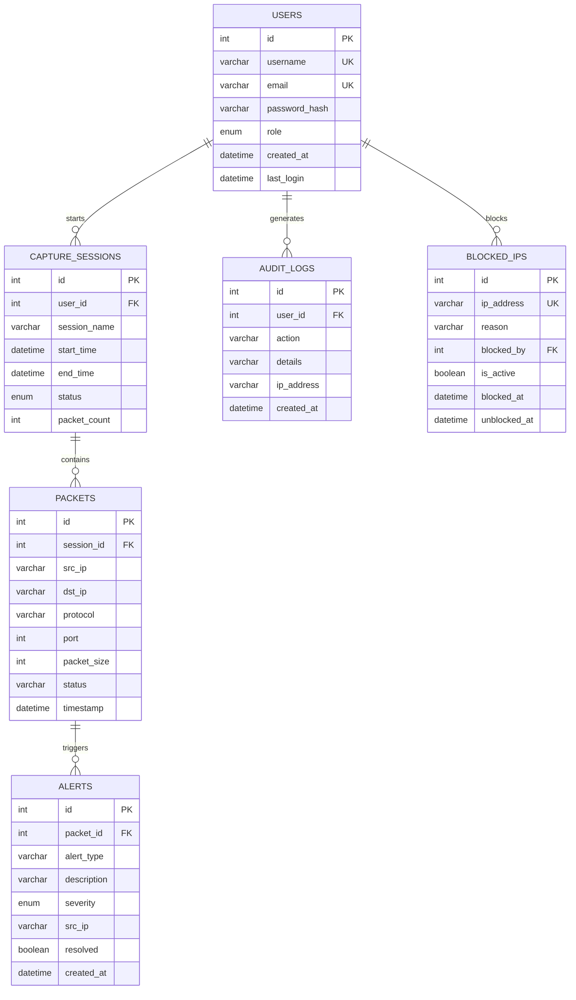
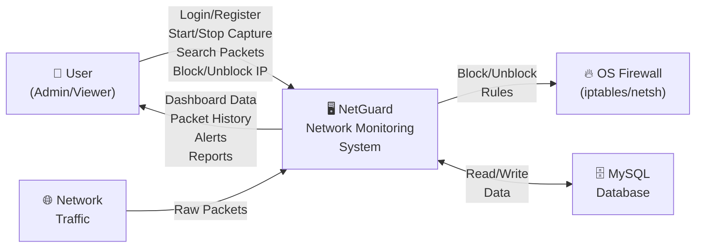
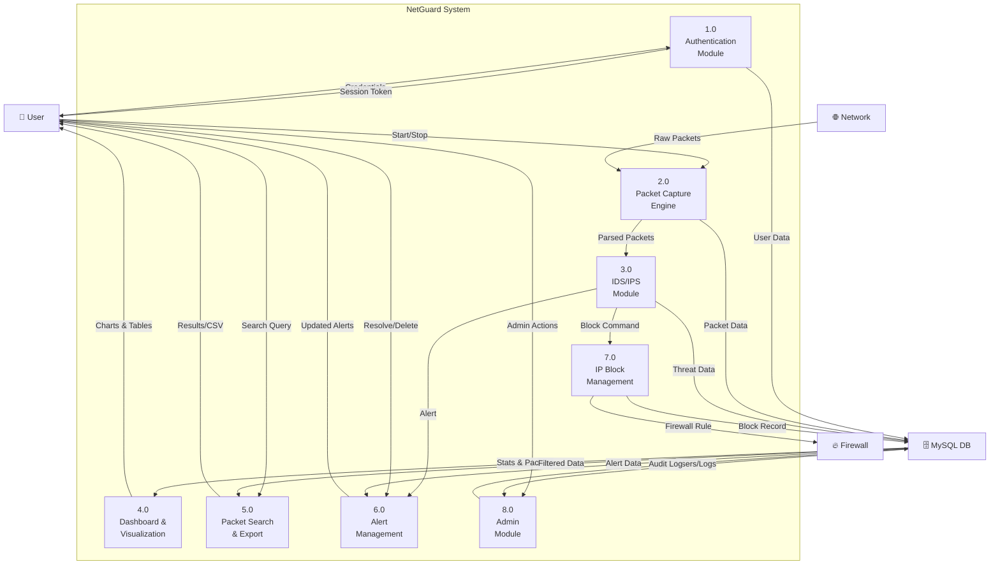
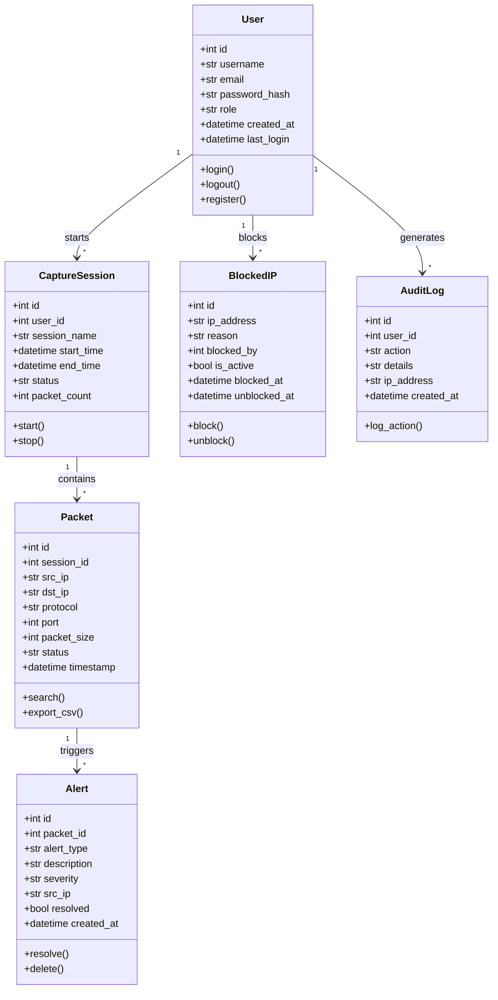

# NetGuard — System Design Documentation
## Network Monitoring Tool (IDS + IPS)

> **Student Project Report — MCA Open-Source Project**

---

## 1. Introduction

NetGuard is a full-stack web-based Network Monitoring Tool with integrated Intrusion Detection System (IDS) and Intrusion Prevention System (IPS). It captures live network packets, analyzes traffic patterns, detects suspicious activities like port scans, and automatically blocks malicious IP addresses through OS-level firewall rules.

The application provides a real-time dashboard with visual analytics, packet history with advanced filtering, alert management, and comprehensive admin controls — all through a modern, dark-themed web interface.

---

## 2. Problem Statement

Network security is a critical concern for organizations of all sizes. Manual monitoring of network traffic is impractical due to the volume and speed of modern network communications. Existing commercial solutions are expensive and proprietary.

There is a need for an open-source, user-friendly network monitoring tool that can:
- Capture and analyze network packets in real-time
- Automatically detect suspicious traffic patterns (Intrusion Detection)
- Block malicious IP addresses without manual intervention (Intrusion Prevention)
- Provide visual analytics and searchable packet history
- Support multiple users with role-based access control

---

## 3. Objectives

1. Develop a full-stack web application for real-time network packet monitoring
2. Implement IDS capabilities to detect port scans and traffic anomalies
3. Implement IPS capabilities to automatically block suspicious IPs via OS firewall
4. Provide a searchable, filterable packet history with CSV export
5. Implement user authentication with role-based access control (Admin/Viewer)
6. Create a visual dashboard with protocol distribution and traffic analytics
7. Maintain a complete audit trail of all user actions
8. Use only open-source technologies throughout the stack

---

## 4. Scope of the System

### In Scope
- Real-time packet capture using Scapy
- Protocol analysis (TCP, UDP, ICMP)
- Threshold-based IDS for port scan detection
- Automated IPS with OS firewall integration (iptables/netsh)
- User authentication and session management
- Role-based access control (Admin and Viewer roles)
- Dashboard with Chart.js visualizations
- Packet search/filter with pagination
- CSV data export
- Alert management with severity levels
- IP block/unblock management
- Audit logging

### Out of Scope
- Deep packet inspection (payload analysis)
- Machine learning-based anomaly detection
- Multi-node distributed monitoring
- Email/SMS alert notifications
- VPN/encrypted traffic analysis

---

## 5. Feasibility Study

### 5.1 Technical Feasibility
- **Python/Flask**: Mature, well-documented web framework with extensive library ecosystem
- **Scapy**: Industry-standard packet manipulation library for Python
- **MySQL**: Reliable, performant open-source RDBMS with excellent community support
- **WebSocket (Socket.IO)**: Enables real-time packet streaming to browser without polling
- **Bootstrap 5**: Responsive CSS framework for rapid UI development
- All chosen technologies are open-source, free, and have active communities

### 5.2 Economic Feasibility
- Zero licensing costs — all technologies are open-source
- Can run on standard hardware (any computer with a network interface)
- No recurring subscription fees
- Minimal infrastructure requirements (single server deployment)

### 5.3 Operational Feasibility
- Web-based interface requires no client installation — accessible via any browser
- Intuitive dashboard with color-coded packet visualization
- Role-based access prevents unauthorized modifications
- Audit logging ensures accountability
- CSV export enables integration with external analysis tools

---

## 6. System Analysis

### 6.1 Existing System
- Manual network monitoring using command-line tools (tcpdump, Wireshark)
- Requires technical expertise to interpret raw packet data
- No automated threat detection or prevention
- No centralized dashboard or multi-user access
- No persistent storage of packet history
- Original Tkinter desktop application — single-user, no database, no authentication

### 6.2 Proposed System
- Web-based application accessible from any browser on the network
- Automated IDS detects port scans when traffic from a single IP exceeds threshold
- Automated IPS blocks detected threats via OS firewall rules
- MySQL database stores all packets, alerts, and user actions persistently
- Real-time WebSocket streaming for live packet monitoring
- Multi-user support with authentication and role-based access
- Visual analytics with charts and color-coded protocol display
- Searchable packet history with filters and CSV export

---

## 7. System Design

### 7.1 ER Diagram (ERD)



### 7.2 Data Flow Diagram — Level 0 (Context Diagram)



### 7.3 Data Flow Diagram — Level 1



### 7.4 Use Case Diagram

```mermaid
graph TB
    subgraph "NetGuard System"
        UC1["🔐 Register"]
        UC2["🔐 Login / Logout"]
        UC3["📊 View Dashboard"]
        UC4["▶️ Start/Stop Capture"]
        UC5["🔍 Search Packets"]
        UC6["📥 Export CSV"]
        UC7["⚠️ View Alerts"]
        UC8["✅ Resolve Alert"]
        UC9["🚫 View Blocked IPs"]
        UC10["🔓 Unblock IP"]
        UC11["🚫 Manually Block IP"]
        UC12["👥 Manage Users"]
        UC13["📋 View Audit Logs"]
        UC14["🗑️ Delete Sessions"]
        UC15["🗑️ Delete Alerts"]
    end

    V["👤 Viewer"] --> UC1
    V --> UC2
    V --> UC3
    V --> UC4
    V --> UC5
    V --> UC6
    V --> UC7
    V --> UC8
    V --> UC9

    A["👑 Admin"] --> UC1
    A --> UC2
    A --> UC3
    A --> UC4
    A --> UC5
    A --> UC6
    A --> UC7
    A --> UC8
    A --> UC9
    A --> UC10
    A --> UC11
    A --> UC12
    A --> UC13
    A --> UC14
    A --> UC15

    IDS["🤖 IDS/IPS<br/>System"] --> UC11
    IDS --> UC15
```



### 7.5 Class Diagram



---

## 8. Database Schema Design

### 8.1 Table Structure

#### Table: `users`
| Column | Data Type | Constraints | Description |
|--------|-----------|-------------|-------------|
| id | INT | PRIMARY KEY, AUTO_INCREMENT | Unique user ID |
| username | VARCHAR(80) | NOT NULL, UNIQUE | Login username |
| email | VARCHAR(120) | NOT NULL, UNIQUE | User email |
| password_hash | VARCHAR(256) | NOT NULL | Bcrypt hashed password |
| role | ENUM('admin','viewer') | NOT NULL, DEFAULT 'viewer' | User role |
| created_at | DATETIME | NOT NULL | Registration timestamp |
| last_login | DATETIME | NULLABLE | Last login time |

#### Table: `capture_sessions`
| Column | Data Type | Constraints | Description |
|--------|-----------|-------------|-------------|
| id | INT | PRIMARY KEY, AUTO_INCREMENT | Session ID |
| user_id | INT | NOT NULL, FOREIGN KEY → users.id | Who started the capture |
| session_name | VARCHAR(200) | NOT NULL | Session identifier |
| start_time | DATETIME | NOT NULL | Capture start time |
| end_time | DATETIME | NULLABLE | Capture end time |
| status | ENUM('running','stopped','completed') | NOT NULL | Current status |
| packet_count | INT | DEFAULT 0 | Total packets captured |

#### Table: `packets`
| Column | Data Type | Constraints | Description |
|--------|-----------|-------------|-------------|
| id | INT | PRIMARY KEY, AUTO_INCREMENT | Packet ID |
| session_id | INT | NOT NULL, FOREIGN KEY → capture_sessions.id | Parent session |
| src_ip | VARCHAR(45) | NOT NULL | Source IP address |
| dst_ip | VARCHAR(45) | NOT NULL | Destination IP address |
| protocol | VARCHAR(10) | NOT NULL | Protocol (TCP/UDP/ICMP) |
| port | INT | NULLABLE | Destination port |
| packet_size | INT | NULLABLE | Packet size in bytes |
| status | VARCHAR(20) | NOT NULL, DEFAULT 'Normal' | Normal or BLOCKED |
| timestamp | DATETIME | NOT NULL | Capture timestamp |

#### Table: `alerts`
| Column | Data Type | Constraints | Description |
|--------|-----------|-------------|-------------|
| id | INT | PRIMARY KEY, AUTO_INCREMENT | Alert ID |
| packet_id | INT | FOREIGN KEY → packets.id | Triggering packet |
| alert_type | VARCHAR(100) | NOT NULL | Type of alert |
| description | VARCHAR(500) | NOT NULL | Alert description |
| severity | ENUM('low','medium','high','critical') | NOT NULL | Severity level |
| src_ip | VARCHAR(45) | NOT NULL | Source IP of threat |
| resolved | BOOLEAN | DEFAULT FALSE | Resolution status |
| created_at | DATETIME | NOT NULL | Alert timestamp |

#### Table: `blocked_ips`
| Column | Data Type | Constraints | Description |
|--------|-----------|-------------|-------------|
| id | INT | PRIMARY KEY, AUTO_INCREMENT | Record ID |
| ip_address | VARCHAR(45) | NOT NULL, UNIQUE | Blocked IP |
| reason | VARCHAR(300) | NOT NULL | Block reason |
| blocked_by | INT | FOREIGN KEY → users.id | Who blocked (null = IPS) |
| is_active | BOOLEAN | DEFAULT TRUE | Currently active block |
| blocked_at | DATETIME | NOT NULL | Block timestamp |
| unblocked_at | DATETIME | NULLABLE | Unblock timestamp |

#### Table: `audit_logs`
| Column | Data Type | Constraints | Description |
|--------|-----------|-------------|-------------|
| id | INT | PRIMARY KEY, AUTO_INCREMENT | Log ID |
| user_id | INT | NOT NULL, FOREIGN KEY → users.id | Acting user |
| action | VARCHAR(100) | NOT NULL | Action performed |
| details | VARCHAR(500) | NULLABLE | Additional details |
| ip_address | VARCHAR(45) | NULLABLE | User's IP address |
| created_at | DATETIME | NOT NULL | Action timestamp |

---

## 9. Implementation Details

### 9.1 Technology Stack

| Component | Technology | Version |
|-----------|-----------|---------|
| Language | Python | 3.x |
| Web Framework | Flask | 3.1.x |
| Real-time | Flask-SocketIO | 5.5.x |
| ORM | Flask-SQLAlchemy | 3.1.x |
| Authentication | Flask-Login | 0.6.x |
| Database | MySQL | 8.x |
| DB Driver | PyMySQL | 1.1.x |
| Packet Capture | Scapy | 2.6.x |
| Password Hashing | Werkzeug | 3.1.x |
| Frontend CSS | Bootstrap | 5.3.x |
| Charts | Chart.js | 4.4.x |
| Real-time Client | Socket.IO | 4.7.x |
| Icons | Bootstrap Icons | 1.11.x |
| Font | Inter (Google Fonts) | — |

### 9.2 Architecture Overview

```
┌─────────────────────────────────────────────────┐
│                  CLIENT (Browser)                │
│  ┌──────────┐  ┌──────────┐  ┌───────────────┐  │
│  │ HTML/CSS │  │ Chart.js │  │ Socket.IO     │  │
│  │ Bootstrap│  │ Graphs   │  │ Real-time     │  │
│  └──────────┘  └──────────┘  └───────┬───────┘  │
└──────────────────────────────────────┼──────────┘
                                       │ WebSocket
┌──────────────────────────────────────┼──────────┐
│                SERVER (Flask)         │          │
│  ┌─────────────┐  ┌─────────────────┼────────┐  │
│  │ Flask Routes │  │ Flask-SocketIO  │        │  │
│  │ (Blueprints) │  │ (Real-time)     │        │  │
│  └──────┬──────┘  └─────────────────┼────────┘  │
│         │                            │           │
│  ┌──────┴──────┐  ┌─────────────────┴────────┐  │
│  │ Flask-Login │  │ Scapy Sniffer            │  │
│  │ (Auth)      │  │ (Background Thread)      │  │
│  └──────┬──────┘  └─────────────────┬────────┘  │
│         │                            │           │
│  ┌──────┴────────────────────────────┴────────┐  │
│  │        SQLAlchemy ORM (Models)             │  │
│  └────────────────────┬───────────────────────┘  │
└───────────────────────┼──────────────────────────┘
                        │ SQL
┌───────────────────────┼──────────────────────────┐
│              MySQL Database                       │
│  ┌────────┐ ┌──────────┐ ┌─────────┐ ┌────────┐ │
│  │ users  │ │ sessions │ │ packets │ │ alerts │ │
│  └────────┘ └──────────┘ └─────────┘ └────────┘ │
│  ┌────────────┐ ┌────────────┐                   │
│  │ blocked_ips│ │ audit_logs │                   │
│  └────────────┘ └────────────┘                   │
└──────────────────────────────────────────────────┘
```

### 9.3 Sample SQL Queries

**INSERT — Register a new user:**
```sql
INSERT INTO users (username, email, password_hash, role, created_at)
VALUES ('john', 'john@example.com', '<hashed_password>', 'viewer', NOW());
```

**SELECT with conditions — Filter packets by protocol and status:**
```sql
SELECT p.*, cs.session_name, u.username
FROM packets p
JOIN capture_sessions cs ON p.session_id = cs.id
JOIN users u ON cs.user_id = u.id
WHERE p.protocol = 'TCP' AND p.status = 'Normal'
ORDER BY p.timestamp DESC
LIMIT 50;
```

**JOIN — Get alerts with associated packet information:**
```sql
SELECT a.*, p.src_ip AS packet_src, p.dst_ip AS packet_dst, p.protocol
FROM alerts a
LEFT JOIN packets p ON a.packet_id = p.id
WHERE a.resolved = FALSE
ORDER BY a.created_at DESC;
```

**UPDATE — Resolve an alert:**
```sql
UPDATE alerts SET resolved = TRUE WHERE id = 5;
```

**UPDATE — Unblock an IP:**
```sql
UPDATE blocked_ips
SET is_active = FALSE, unblocked_at = NOW()
WHERE id = 3;
```

**DELETE — Delete a user:**
```sql
DELETE FROM capture_sessions WHERE user_id = 7;
DELETE FROM users WHERE id = 7;
```

**JOIN — Blocked IPs with who blocked them:**
```sql
SELECT b.ip_address, b.reason, b.blocked_at, b.is_active, u.username AS blocked_by
FROM blocked_ips b
LEFT JOIN users u ON b.blocked_by = u.id
ORDER BY b.blocked_at DESC;
```

**Aggregate — Protocol distribution stats:**
```sql
SELECT protocol, COUNT(*) AS count
FROM packets
GROUP BY protocol;
```

**Aggregate — Top 10 source IPs:**
```sql
SELECT src_ip, COUNT(*) AS packet_count
FROM packets
GROUP BY src_ip
ORDER BY packet_count DESC
LIMIT 10;
```

---

## 10. Testing

### 10.1 Test Cases

| # | Test Case | Input | Expected Result | Status |
|---|-----------|-------|-----------------|--------|
| 1 | User Registration | Valid username, email, password | Account created, redirect to login | ✅ |
| 2 | Duplicate Username | Existing username | Error: "Username already exists" | ✅ |
| 3 | User Login | Valid credentials | Dashboard displayed, session created | ✅ |
| 4 | Invalid Login | Wrong password | Error: "Invalid username or password" | ✅ |
| 5 | Start Capture | Click Start Capture | Packets stream in real-time | ✅ |
| 6 | Stop Capture | Click Stop Capture | Streaming stops, session saved | ✅ |
| 7 | Packet Filter | Protocol=TCP, Source IP=192.168.x | Filtered results displayed | ✅ |
| 8 | CSV Export | Click Export CSV | File downloads with packet data | ✅ |
| 9 | IDS Detection | Send >20 packets from same IP | Alert created, severity=high | ✅ |
| 10 | IPS Blocking | Threshold exceeded | IP blocked, firewall rule added | ✅ |
| 11 | Resolve Alert | Click resolve button | Alert marked resolved | ✅ |
| 12 | Manual Block IP | Enter IP, click Block | IP added to blocked list | ✅ |
| 13 | Unblock IP | Click Unblock | IP removed from block list | ✅ |
| 14 | Viewer Role Access | Viewer tries admin page | Access denied message | ✅ |
| 15 | Audit Log | Perform any action | Action logged with timestamp | ✅ |
| 16 | Delete User | Admin deletes viewer | User removed from database | ✅ |
| 17 | Session Timeout | Inactive session | Redirect to login page | ✅ |
| 18 | Pagination | >50 packets | Paginated table with navigation | ✅ |

---

## 11. Results & Conclusion

### Results
The NetGuard Network Monitoring Tool successfully demonstrates:
- Real-time packet capture and analysis using Scapy with WebSocket streaming
- Automated intrusion detection based on traffic threshold analysis
- Automated intrusion prevention via OS firewall rule management
- Full CRUD operations on a properly normalized MySQL database with 6 tables
- Secure authentication with password hashing and role-based access control
- Modern, responsive web interface with dark theme and data visualizations

### Conclusion
The project achieves its objective of providing an open-source, full-stack network monitoring solution. It converts a simple desktop Tkinter application into a comprehensive web application with database integration, authentication, and real-time capabilities. The IDS/IPS functionality provides genuine security value, while the admin panel and audit logging ensure accountability.

---

## 12. Future Enhancements

1. **Machine Learning IDS** — Train models on packet data for anomaly detection
2. **Email/SMS Alerts** — Notify administrators of critical security events
3. **Deep Packet Inspection** — Analyze packet payloads for malware signatures
4. **Multi-node Monitoring** — Deploy agents on multiple network nodes
5. **GeoIP Mapping** — Visualize attack sources on a world map
6. **Custom IDS Rules** — Allow admins to define custom detection rules
7. **API Integration** — REST API for external SIEM tool integration
8. **Traffic Bandwidth Monitoring** — Track bandwidth usage over time
9. **Encrypted Traffic Analysis** — TLS/SSL metadata analysis
10. **Docker Deployment** — Containerized deployment for easy setup

---

## 13. Bibliography / References

1. Flask Documentation — https://flask.palletsprojects.com/
2. Scapy Documentation — https://scapy.readthedocs.io/
3. Flask-SQLAlchemy — https://flask-sqlalchemy.palletsprojects.com/
4. Flask-SocketIO — https://flask-socketio.readthedocs.io/
5. Flask-Login — https://flask-login.readthedocs.io/
6. MySQL Documentation — https://dev.mysql.com/doc/
7. Bootstrap 5 — https://getbootstrap.com/docs/5.3/
8. Chart.js — https://www.chartjs.org/docs/
9. Socket.IO — https://socket.io/docs/
10. Python Documentation — https://docs.python.org/3/
11. Werkzeug Security — https://werkzeug.palletsprojects.com/
12. OWASP Network Security Guidelines — https://owasp.org/
